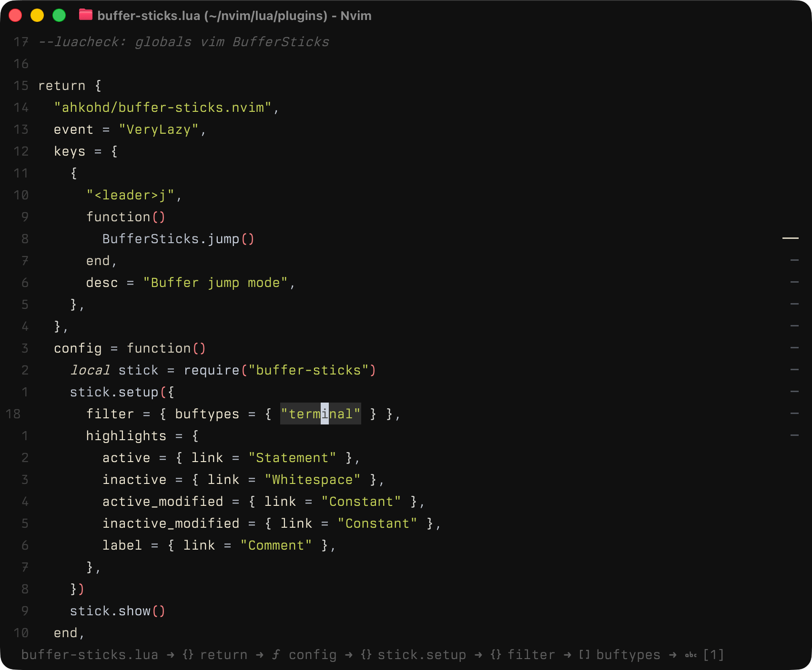
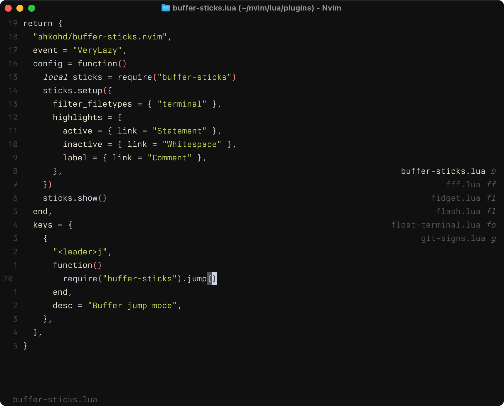

# buffer-sticks.nvim

A neovim plugin that displays a vertical indicator showing open buffers.



Jump mode for quick buffer navigation:



## Features

- Visual representation of open buffers
- Highlights the currently active buffer
- Jump mode for quick buffer navigation by typing characters
- Configurable positioning and appearance
- Transparent background support
- Persists highlight configuration across colorscheme changes

## Installation

Using [lazy.nvim](https://github.com/folke/lazy.nvim):

```lua
{
  "ahkohd/buffer-sticks.nvim",
  config = function()
    require("buffer-sticks").setup()
  end,
}
```

Using [packer.nvim](https://github.com/wbthomason/packer.nvim):

```lua
use {
  "ahkohd/buffer-sticks.nvim",
  config = function()
    require("buffer-sticks").setup()
  end
}
```

### Quick Setup

```lua
return {
	"ahkohd/buffer-sticks.nvim",
	event = "VeryLazy",
	keys = {
		{
			"<leader>j",
			function()
				BufferSticks.jump()
			end,
			desc = "Buffer jump mode",
		},
	},
	config = function()
		local stick = require("buffer-sticks")
		stick.setup({
			filter = { buftypes = { "terminal" } },
			highlights = {
				active = { link = "Statement" },
				inactive = { link = "Whitespace" },
				label = { link = "Comment" },
			},
		})
		stick.show()
	end,
}
```

## Configuration

```lua
require("buffer-sticks").setup({
  offset = { x = 0, y = 0 },    -- Position offset (positive moves inward from right edge)
  padding = { top = 0, right = 1, bottom = 0, left = 1 }, -- Padding inside the float
  active_char = "──",           -- Character for active buffer
  inactive_char = " ─",         -- Character for inactive buffers
  transparent = true,           -- Remove background color (shows terminal/editor background)
  auto_hide = true,                -- Auto-hide when cursor is over float (default: true)
  label = { show = "jump" },       -- Label display: "always", "jump", or "never"
  jump = { show = { "filename", "space", "label" } }, -- Jump mode display options
  -- winblend = 100,                    -- Window blend level (0-100, 0=opaque, 100=fully blended)
  -- filter = {
  --   filetypes = { "help", "qf" },    -- Exclude by filetype (also: "NvimTree", "neo-tree", "Trouble")
  --   buftypes = { "terminal" },       -- Exclude by buftype (also: "help", "quickfix", "nofile")
  --   names = { ".*%.git/.*", "^/tmp/.*" },  -- Exclude buffers matching lua patterns
  -- },
  highlights = {
    active = { fg = "#ffffff" },
    inactive = { fg = "#666666" },
    label = { fg = "#ffff00" }
  }
})
```

## Usage

```lua
-- Toggle visibility
BufferSticks.toggle()

-- Show
BufferSticks.show()

-- Hide
BufferSticks.hide()

-- Enter jump mode to navigate by typing
BufferSticks.jump()
```

## Jump Mode

Jump mode allows you to quickly navigate to buffers by typing their first character(s):

1. Call `BufferSticks.jump()`
2. Type the first character of the buffer you want to jump to
3. If multiple buffers match, continue typing more characters
4. Press `Esc` or `Ctrl-C` to cancel

**Label Display Options:**
- `label = { show = "always" }` - Always show buffer name labels
- `label = { show = "jump" }` - Only show labels when in jump mode (default)
- `label = { show = "never" }` - Never show labels

**Jump Mode Display Options:**
- **Default**: `jump = { show = { "filename", "space", "label" } }`

**Available elements:**
- `"filename"` - Full filename
- `"space"` - Spaces between elements
- `"label"` - Unique character
- `"stick"` - Active/inactive character

### Highlight Options

You can use hex colors:

```lua
highlights = {
  active = { fg = "#ffffff" },
  inactive = { fg = "#666666" },
  label = { fg = "#ffff00" }
}
```

Or link to existing highlight groups:

```lua
highlights = {
  active = { link = "Statement" },
  inactive = { link = "Whitespace" },
  label = { link = "Comment" }
}
```

## API

- `setup(opts)` - Initialize the plugin with configuration
- `toggle()` - Toggle buffer sticks visibility
- `show()` - Show buffer sticks
- `hide()` - Hide buffer sticks
- `jump()` - Enter jump mode for quick buffer navigation
